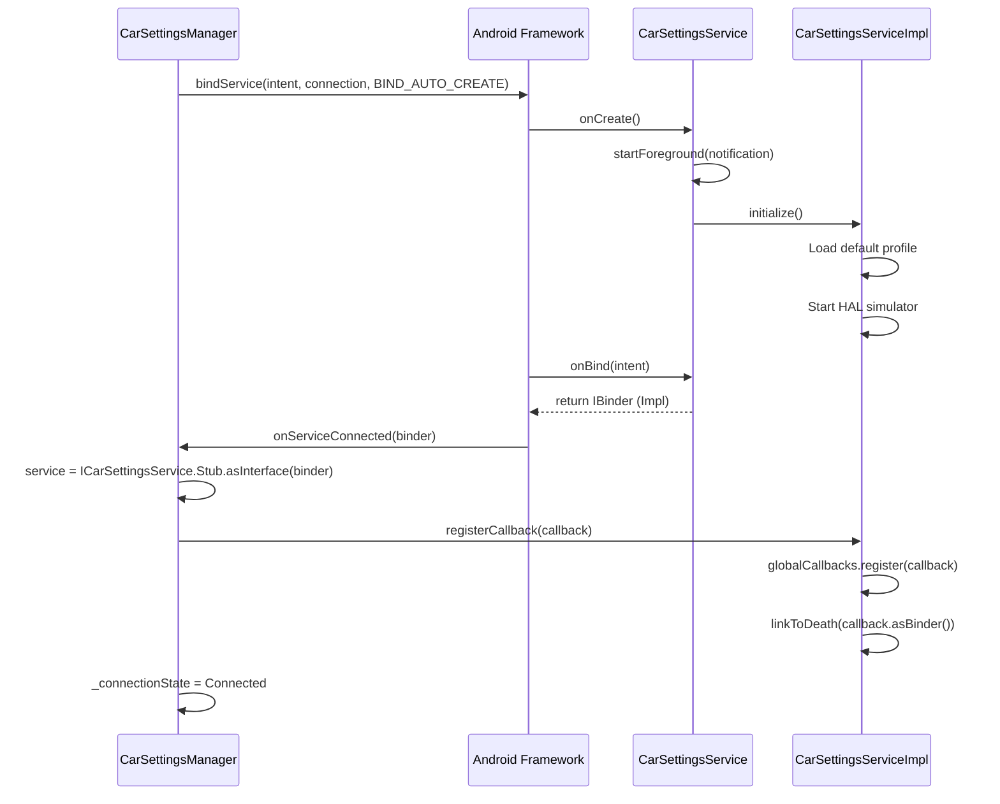
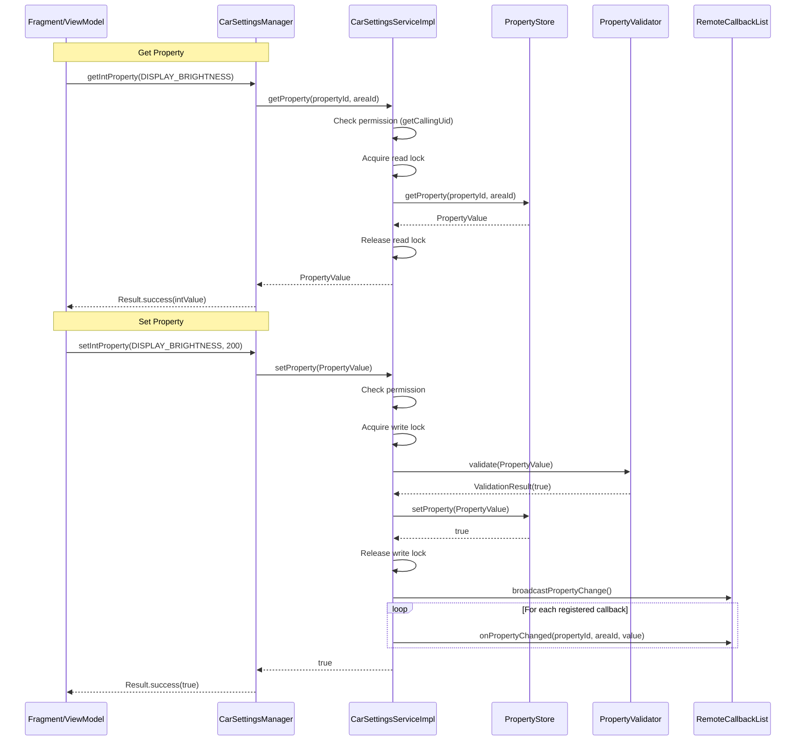
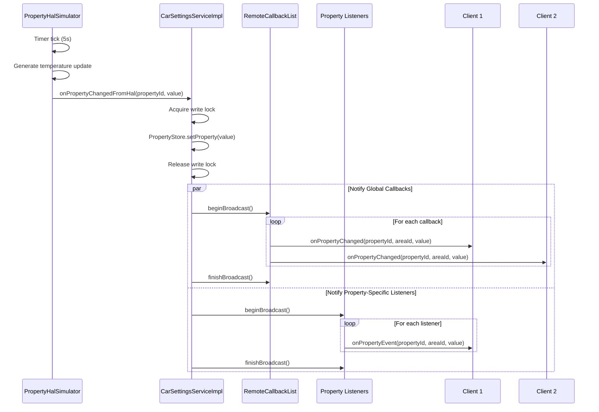
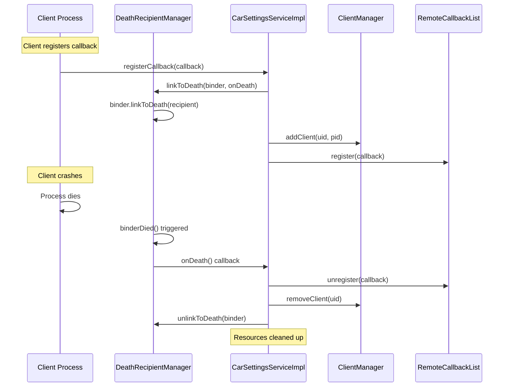

# Architecture Documentation

This document provides detailed technical architecture information for the Car Settings AIDL Service project.

## Table of Contents

1. [System Architecture](#system-architecture)
2. [Sequence Diagrams](#sequence-diagrams)
3. [Threading Model](#threading-model)
4. [Data Flow](#data-flow)
5. [Key Design Decisions](#key-design-decisions)

## System Architecture

### High-Level Component Diagram

```
┌─────────────────────────────────────────────────────────────────┐
│                        Client Process                           │
│  ┌────────────────────────────────────────────────────────────┐ │
│  │                      UI Layer                              │ │
│  │  ┌──────────┐  ┌──────────┐  ┌──────────┐  ┌──────────┐  │ │
│  │  │Dashboard │  │ Display  │  │  Audio   │  │ Climate  │  │ │
│  │  │Fragment  │  │ Fragment │  │ Fragment │  │ Fragment │  │ │
│  │  └────┬─────┘  └────┬─────┘  └────┬─────┘  └────┬─────┘  │ │
│  │       └─────────────┬──────────────┴──────────────┘        │ │
│  │                     ▼                                       │ │
│  │            ┌─────────────────┐                             │ │
│  │            │   ViewModels    │                             │ │
│  │            └────────┬────────┘                             │ │
│  └─────────────────────┼──────────────────────────────────────┘ │
│                        ▼                                         │
│  ┌─────────────────────────────────────────────────────────┐   │
│  │              Manager Layer                              │   │
│  │  ┌───────────────────────────────────────────────────┐  │   │
│  │  │         CarSettingsManager                        │  │   │
│  │  │  • ServiceConnection                              │  │   │
│  │  │  • ConnectionState (StateFlow)                    │  │   │
│  │  │  • Property observation (Flow)                    │  │   │
│  │  │  • Auto-reconnect with backoff                    │  │   │
│  │  └───────────┬───────────────────────────────────────┘  │   │
│  └──────────────┼──────────────────────────────────────────┘   │
│                 │                                               │
│                 │ AIDL IPC                                      │
│                 ▼                                               │
└─────────────────────────────────────────────────────────────────┘
                  │
                  │ Binder
                  │
┌─────────────────▼─────────────────────────────────────────────────┐
│                      Service Process                              │
│  ┌─────────────────────────────────────────────────────────────┐  │
│  │            CarSettingsService (Android Service)             │  │
│  │                     Foreground Service                       │  │
│  └──────────────────────────┬──────────────────────────────────┘  │
│                             ▼                                      │
│  ┌─────────────────────────────────────────────────────────────┐  │
│  │         CarSettingsServiceImpl (Stub)                       │  │
│  │  ┌────────────────────────────────────────────────────────┐ │  │
│  │  │  • RemoteCallbackList<ICarSettingsCallback>          │ │  │
│  │  │  • ConcurrentHashMap<PropertyId, RemoteCallbackList> │ │  │
│  │  │  • ReentrantReadWriteLock                            │ │  │
│  │  │  • Binder.getCallingUid()/Pid() tracking            │ │  │
│  │  └────────────────────────────────────────────────────────┘ │  │
│  └──────┬──────────────┬──────────────┬───────────────┬────────┘  │
│         │              │              │               │            │
│         ▼              ▼              ▼               ▼            │
│  ┌───────────┐  ┌──────────┐  ┌─────────────┐ ┌──────────────┐  │
│  │ Property  │  │ Property │  │  Property   │ │   Client     │  │
│  │   Store   │  │ Registry │  │  Validator  │ │   Manager    │  │
│  │           │  │          │  │             │ │              │  │
│  │ • Values  │  │ • Infos  │  │ • Range     │ │ • ClientInfo │  │
│  │ • DataSto │  │ • Configs│  │ • Type      │ │ • UID/PID    │  │
│  │   re      │  │ • Areas  │  │   checks    │ │ • Tracking   │  │
│  └─────┬─────┘  └──────────┘  └─────────────┘ └──────────────┘  │
│        │                                                           │
│        ▼                                                           │
│  ┌──────────────────┐         ┌─────────────────────┐            │
│  │   HAL Simulator  │◄────────│ DeathRecipient      │            │
│  │  (Background     │         │    Manager          │            │
│  │   Coroutine)     │         │ • linkToDeath       │            │
│  │ • Temperature    │         │ • unlinkToDeath     │            │
│  │ • Random updates │         │ • Cleanup on crash  │            │
│  └──────────────────┘         └─────────────────────┘            │
└───────────────────────────────────────────────────────────────────┘
```

## Sequence Diagrams

### 1. Service Binding Flow



### 2. Property Get/Set Flow



### 3. Callback Notification Flow



### 4. Client Death Handling



## Threading Model

### Service Process Threads

```
┌─────────────────────────────────────────────────────────────────┐
│                      Service Process                            │
│                                                                 │
│  ┌──────────────────────────────────────────────────────────┐  │
│  │ Main Thread                                              │  │
│  │ • Service lifecycle (onCreate, onBind, onDestroy)        │  │
│  │ • Client connection management                           │  │
│  └──────────────────────────────────────────────────────────┘  │
│                                                                 │
│  ┌──────────────────────────────────────────────────────────┐  │
│  │ Binder Thread Pool (managed by Android)                 │  │
│  │ • AIDL method calls (getProperty, setProperty, etc.)     │  │
│  │ • Multiple concurrent calls from different clients       │  │
│  │ • Uses ReentrantReadWriteLock for synchronization       │  │
│  └──────────────────────────────────────────────────────────┘  │
│                                                                 │
│  ┌──────────────────────────────────────────────────────────┐  │
│  │ Coroutine Scope (Dispatchers.Default)                   │  │
│  │ • PropertyHalSimulator - background property updates     │  │
│  │ • Callback broadcasting (non-blocking oneway calls)      │  │
│  └──────────────────────────────────────────────────────────┘  │
│                                                                 │
│  ┌──────────────────────────────────────────────────────────┐  │
│  │ Binder IPC Threads                                       │  │
│  │ • Outgoing oneway callbacks to clients                   │  │
│  │ • Non-blocking to prevent deadlocks                      │  │
│  └──────────────────────────────────────────────────────────┘  │
└─────────────────────────────────────────────────────────────────┘
```

### Thread Safety Mechanisms

1. **PropertyStore**: Uses `ReentrantReadWriteLock`
   ```kotlin
   lock.read {
       propertyStore.getProperty(propertyId, areaId)
   }

   lock.write {
       propertyStore.setProperty(value)
   }
   ```

2. **Client Tracking**: Uses `ConcurrentHashMap`
   ```kotlin
   private val clients = ConcurrentHashMap<Int, ClientInfo>()
   ```

3. **Callbacks**: Uses `RemoteCallbackList` (thread-safe)
   ```kotlin
   val count = callbacks.beginBroadcast()
   try {
       for (i in 0 until count) {
           callbacks.getBroadcastItem(i)?.onPropertyChanged(...)
       }
   } finally {
       callbacks.finishBroadcast()
   }
   ```

### Client Process Threads

```
┌─────────────────────────────────────────────────────────────────┐
│                      Client Process                             │
│                                                                 │
│  ┌──────────────────────────────────────────────────────────┐  │
│  │ Main Thread (UI Thread)                                  │  │
│  │ • Activity/Fragment lifecycle                            │  │
│  │ • View updates                                           │  │
│  │ • StateFlow collection                                   │  │
│  └──────────────────────────────────────────────────────────┘  │
│                                                                 │
│  ┌──────────────────────────────────────────────────────────┐  │
│  │ ViewModel Coroutine Scope (Dispatchers.Main)            │  │
│  │ • Property get/set operations (suspend functions)        │  │
│  │ • Flow collection and transformation                     │  │
│  └──────────────────────────────────────────────────────────┘  │
│                                                                 │
│  ┌──────────────────────────────────────────────────────────┐  │
│  │ CarSettingsManager Coroutine Scope                      │  │
│  │ • ServiceConnection callbacks                            │  │
│  │ • Property change event emission                         │  │
│  │ • Reconnection logic with backoff                        │  │
│  └──────────────────────────────────────────────────────────┘  │
│                                                                 │
│  ┌──────────────────────────────────────────────────────────┐  │
│  │ Binder IPC Threads                                       │  │
│  │ • Incoming oneway callbacks from service                 │  │
│  │ • onPropertyChanged, onServiceStatusChanged              │  │
│  └──────────────────────────────────────────────────────────┘  │
└─────────────────────────────────────────────────────────────────┘
```

## Data Flow

### Property Update Flow

```
User Action (UI)
    │
    ▼
ViewModel.setProperty()
    │
    ▼
CarSettingsManager.setIntProperty()
    │
    ▼
[Coroutine: Dispatchers.IO]
    │
    ▼
ICarSettingsService.setProperty() ──► [Binder IPC]
    │
    ▼
[Service Binder Thread]
CarSettingsServiceImpl.setProperty()
    │
    ├─► PermissionChecker.check()
    │
    ├─► PropertyValidator.validate()
    │
    ├─► [Write Lock]
    │   PropertyStore.setProperty()
    │   [Release Write Lock]
    │
    └─► [Coroutine: Background]
        RemoteCallbackList.broadcast()
            │
            ├─► Client1.onPropertyChanged() ──► [Binder IPC]
            │        │
            │        ▼
            │   [Client Binder Thread]
            │   CarSettingsManager.callback
            │        │
            │        ▼
            │   SharedFlow.emit(event)
            │        │
            │        ▼
            │   [Main/UI Thread]
            │   ViewModel collects
            │        │
            │        ▼
            │   StateFlow updates
            │        │
            │        ▼
            │   UI re-renders
            │
            └─► Client2.onPropertyChanged() ──► [...]
```

### Driver Profile Switch Flow

```
User selects profile
    │
    ▼
ViewModel.switchProfile(profileId)
    │
    ▼
CarSettingsManager.switchDriverProfile(profileId)
    │
    ▼
[Binder IPC]
    │
    ▼
CarSettingsServiceImpl.switchDriverProfile()
    │
    ▼
[Write Lock]
    │
    ├─► PropertyStore.saveProfile(currentProfileId)
    │       └─► DataStore.edit { save all properties }
    │
    ├─► currentProfileId = profileId
    │
    └─► PropertyStore.loadProfile(profileId)
            └─► DataStore.data.first() { load properties }
    │
[Release Write Lock]
    │
    └─► RemoteCallbackList.broadcast()
            └─► onDriverProfileChanged(oldId, newId)
```

## Key Design Decisions

### 1. Why RemoteCallbackList?

**Problem**: Managing multiple client callbacks with proper cleanup on client death.

**Solution**: `RemoteCallbackList<T>` provides:
- Thread-safe registration/unregistration
- Automatic cleanup on client death
- Efficient broadcasting with `beginBroadcast()/finishBroadcast()`

**Code**:
```kotlin
private val globalCallbacks = RemoteCallbackList<ICarSettingsCallback>()

// Registration
globalCallbacks.register(callback)

// Broadcasting
val count = globalCallbacks.beginBroadcast()
try {
    for (i in 0 until count) {
        globalCallbacks.getBroadcastItem(i)?.onPropertyChanged(...)
    }
} finally {
    globalCallbacks.finishBroadcast()
}
```

### 2. Why Oneway Methods for Callbacks?

**Problem**: Callbacks can block the service if client is slow or deadlocked.

**Solution**: Mark callback methods as `oneway` in AIDL:
```aidl
interface ICarSettingsCallback {
    oneway void onPropertyChanged(int propertyId, int areaId, in PropertyValue value);
}
```

**Benefits**:
- Non-blocking: Service doesn't wait for client to process
- Prevents deadlocks
- Better performance under load

### 3. Why ReentrantReadWriteLock?

**Problem**: High-frequency property reads with occasional writes.

**Solution**: `ReentrantReadWriteLock` allows:
- Multiple concurrent reads
- Exclusive writes
- Better performance than simple `synchronized`

**Usage**:
```kotlin
private val lock = ReentrantReadWriteLock()

// Many readers
lock.read { propertyStore.getProperty(...) }

// Single writer
lock.write { propertyStore.setProperty(...) }
```

### 4. Why Coroutines for Callbacks?

**Problem**: Broadcasting to many clients can take time.

**Solution**: Launch coroutine on background dispatcher:
```kotlin
scope.launch(Dispatchers.Default) {
    val count = globalCallbacks.beginBroadcast()
    // ... broadcast to all clients
}
```

**Benefits**:
- Non-blocking on binder thread
- Handles exceptions gracefully
- Can be cancelled on service shutdown

### 5. Why DataStore over SharedPreferences?

**Problem**: SharedPreferences is synchronous and not coroutine-friendly.

**Solution**: DataStore Preferences provides:
- Asynchronous API with Flow
- Type safety
- Handles errors gracefully
- Transactional updates

**Usage**:
```kotlin
context.profileDataStore.edit { prefs ->
    prefs[intPreferencesKey(key)] = value
}
```

### 6. Why Hilt for Dependency Injection?

**Problem**: Manual dependency management is error-prone.

**Solution**: Hilt provides:
- Compile-time dependency graph validation
- Scoped instances (@Singleton, @ActivityScoped)
- Android-aware injection
- Testing support with @HiltAndroidTest

### 7. Why Flow over LiveData?

**Problem**: LiveData is Android-specific and less flexible.

**Solution**: Kotlin Flow provides:
- Platform-agnostic (can be used in pure Kotlin)
- Powerful operators (map, filter, combine, etc.)
- Cold streams (only active when collected)
- Better testing with Turbine

**Usage**:
```kotlin
fun observeProperty(propertyId: Int): Flow<PropertyValue> = callbackFlow {
    // Register listener
    service?.registerPropertyListener(propertyId, listener)

    awaitClose {
        service?.unregisterPropertyListener(propertyId, listener)
    }
}
```

## Performance Considerations

### Binder Transaction Limits

- **Size Limit**: 1MB total per process
- **Property batching**: Use `getPropertiesBatch()` for multiple properties
- **Large data**: Store references, not data, in AIDL calls

### Memory Management

- **RemoteCallbackList**: Automatically cleaned on client death
- **PropertyStore**: Bounded by number of properties (~50)
- **DataStore**: Efficient binary serialization

### Network/IPC Optimization

- **Oneway calls**: Non-blocking callbacks
- **Batching**: Reduce IPC calls with batch operations
- **Caching**: Client-side property cache reduces IPC

---

This architecture demonstrates production-ready AAOS patterns suitable for interview discussions and real-world automotive applications.
